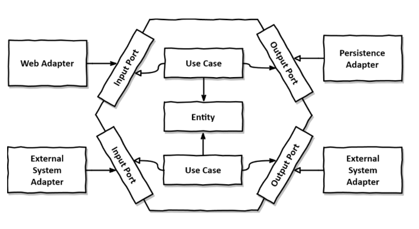
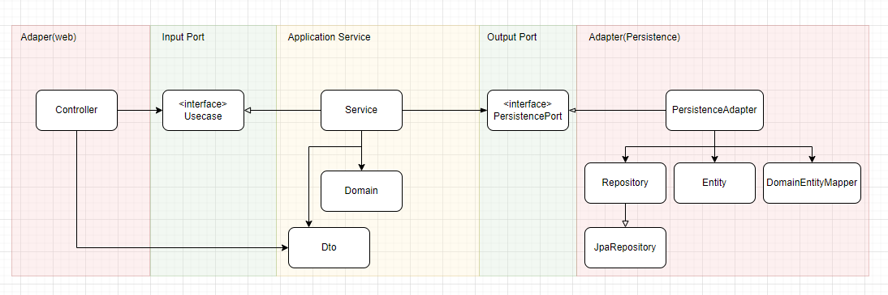

# Shop domain (Hexagonal Architecture)

> Import API list

```
    [framework]
    spring-boot-starter-web
    
    [docs]
    org.springdoc

    [db]
    spring-boot-starter-data-jpa
    com.h2database
    spring-boot-starter-data-redis

    [test]
    spring-boot-starter-test
    spring-security-test

```

> Project Map

```
- shop
  + adapter                 
    + in                    … Internal Adapter
      + web                 … Rest Controller
    + out                   … External Adapter
      + persistence         … jpa repository/entity/mapper/persistenceAdapter
  + application              
    + port                  
      + in                  … Usecase Interface (Input Port)
      + out                 … PersistencePort Interface (Output Port)
    + service               … Applilcation Service 
      + dto                 … Dto(web, service)
  + config                  … config(swagger)
  + domain                  … application domain
  - ShopApplication.java    … Entry Point.
  ```


> shop Architecture 
 
 - Hexagonal Architecture
  - 기존 Layered Architecture 구성 된 project의 shop 부분을 refactoring

    ※ 원본 https://github.com/jaemocho/seq

  - 기본 디자인
   
  
  - 구현 디자인 
   

  


